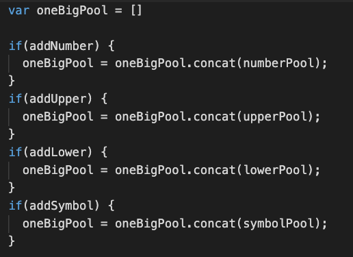

### **Secure Password Generator**###

> This Secure Password Generator was created for companies that handle sensitive data and their employees to ensure that a strong password is used. 

//This application creates a random and secure password based on the following criteria. 

***Length (must be between 8 and 128 characters)***

**Prompts user to choose between different characters such as: 
-Numbers 
-Upper & Lowercase letters 
-and/or special characters. 

The user may chose one or all of the options available.
The password will then generate based on users input.

#### **Code Samples**

>The application consist of 
function writePassword() using a different variables,for loops, and more. I attached snippets of code below. 

**Function:**

**Variables used:**

**oneBigPool | for loops**

### **Screenshots of Deployed Site** ###

[Click here to view published site] or (https://danielthomas129.github.io/sec-password-generator/)

[Click here to view Github Repository] or (https://github.com/danielthomas129/sec-password-generator)

